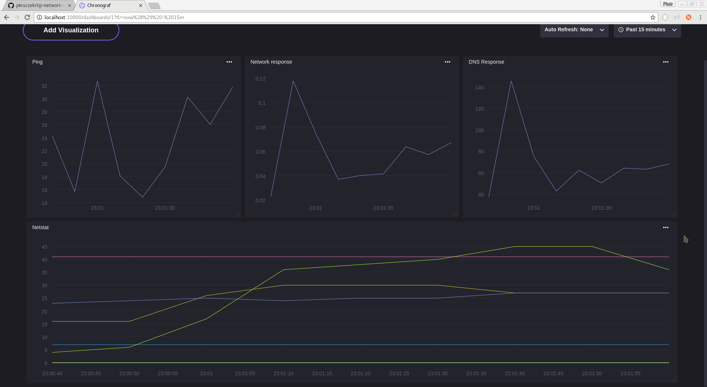

# Docker image collecting network stats - TIP Project

### Overview
This is a Docker image which allows to gather, visualize and monitor network data.
It contains [InfluxData](https://www.influxdata.com/) tools:


* **InfluxDB** 

   > InfluxDB is an open source time series database with no external dependencies. It's useful for recording metrics, events, and performing analytics.
   
   `tip-network-stats` uses InfluxDB to store network data. 
   
   See also [Github repo](https://github.com/influxdata/influxdb)

* **Telegraf** 
   
   > Telegraf is an agent written in Go for collecting, processing, aggregating, and writing metrics.
   
   Image `tip-network-stats` contains prepared Telegraf config for gathering network statistics (take a look at used [plugins](#gathered-data)). Telegraf can push data to different collectors (e.g. *InfluxDB*, *RabbitMQ*, *MQTT*), so `tip-network-stats` uses InfluxDB to store data gathered by Telegraf.
   
   Depends on: InfluxDB

   See also [Github repo](https://github.com/influxdata/telegraf)

* **Chronograf**

   > Chronograf is an open-source web application written in Go and React.js that provides the tools to visualize your monitoring data and easily create alerting and automation rules.

   Chronograf provides simple web inteface for displaying data stored in InfluxDB. `tip-network-stats` contains simple Chronograf [dashboard](documentation/images/chronograf_screen.png)

   Depends on: InfluxDB, Telegraf (which gathers data)

   See also [Github repo](https://github.com/influxdata/chronograf)

* **Kapacitor**

   > Open source framework for processing, monitoring, and alerting on time series data

   Kapacitor uses a DSL named [TICKscript](https://docs.influxdata.com/kapacitor/latest/tick/) to define tasks. Image `tip-network-stats` contains [sample pingAlert.tick](kapacitor/pingAlert.tick) for alerting on ping delays. 

   Depends on: InfluxDB, Telegraf (which gathers data)

   See also [Github repo](https://github.com/influxdata/kapacitor)


### Gathered data
This container uses Telegraf to gather data.

It uses following plugins by default:
* [dns query time](https://github.com/influxdata/telegraf/tree/master/plugins/inputs/dns_query)
* [http_response](https://github.com/influxdata/telegraf/tree/master/plugins/inputs/http_response)
* [system.net](https://github.com/influxdata/telegraf/blob/master/plugins/inputs/system/NET_README.md)
* [net_response](https://github.com/influxdata/telegraf/tree/master/plugins/inputs/net_response)
* [system.netstat](https://github.com/influxdata/telegraf/blob/master/plugins/inputs/system/NETSTAT_README.md)
* [nstat](https://github.com/influxdata/telegraf/tree/master/plugins/inputs/nstat)
* [ping](https://github.com/influxdata/telegraf/tree/master/plugins/inputs/ping)

More info about available plugins: [Telegraf Github repo](https://github.com/influxdata/telegraf/blob/master/README.md)

More about default config: [telegraf.conf](./telegraf/telegraf.conf). How to use custom config? see [Custom configuration](#custom-configuration)

### How to get Docker image?

#### Pull from Docker repository
```
docker pull pkruczek/tip-network-stats
```

#### Or build on your own

###### Clone Git repository

```
git clone https://github.com/pkruczek/tip-network-stats.git
```
###### Get into project directory
```
cd tip-network-stats
```
###### Build Docker image
```
docker build -t tip-network-stats .
```

### How to run Docker container?

###### Run Docker container
```
docker run --net=host -p 10000:10000 tip-network-stats
```
You need to use full image name if you pulled image from Docker Hub, because `tip-network-stats` isn't official Docker image yet
```
docker run --net=host -p 10000:10000 pkruczek/tip-network-stats
```

Explanation:
* `--net=host` - this flag set host's network as container network. It's required because docker creates dedicated network for containers.
* `-p 10000:10000` - bind container's port 10000 to host's 10000. It allows to access Chronograf dashboards on [http://localhost:10000][chronograf]

#### Access [Chronograf][chronograf]
Chronograf is available on port 10000

###### Custom Chronograf dashboard
This image contains prepared simple Chronograf dashboard.



If you want to build a new dashboard
or use custom one, you can replace Chronograf db using following command:
```
docker run --net=host -v $PWD/chronograf.db:/var/lib/chronograf/chronograf.db -p 10000:10000 tip-network-stats
```
Any new view created will be saved in mounted file `chronograf.db` in current directory.
When you want to run container with that custom file, you should run the same command (in the
same directory)


#### Access [InfluxDB Admin][influx-admin]
InfluxDB Admin is available on port 8083 (run with flag `-p 8083:8083`)

### Seting up Kapacitor
example kapacitor alert is prepared in pingAlert.tick file it check average ping to 8.8.8.8 host in 10 s periods and check if is not higher then 300 ms INFO , 500 ms WARN , 800 ms ERROR and save alerts to /tmp/ping_log.txt . Alerts can be also send on email or slack chanel etc.
example comand to send email just add it at the end of pingAlert.tick file or insted  .log('/tmp/ping_log.txt') 
```
.email('oncall@example.com')
```
to add more recivers type after .email()
```
.to('support@example.com')
```

more info about how to write tick scripts can be find 
https://docs.influxdata.com/kapacitor/v1.2/

#### To add new script 
you need to create proper tick script file in kapacitor folder then add 
```
kapacitor define {ALERT NAME} \
    -type {ALERT TYPE batch/stream} \
    -tick /var/lib/kapacitor/{FILE NAME} \
    -dbrp telegraf.autogen

kapacitor enable {ALERT NAME}
```
to runKapacitorAlerts.sh file in root dir 

 container need to be rebuild after meking change in files in repository dir.
 to make experiments just Log into the container and have fun.
 
 all kapacitor propertis and configuration can be changed in kapacitor/kapacitor.conf file
 for example to send email in alert can be necesery to add smtp configuration.
 
 more infocan be find 
https://docs.influxdata.com/kapacitor/v1.2/

### Custom configuration

All tools can be run with custom config. To use custom configuration file you need to run container with flag `-v $PWD/telegraf.conf:/var/lib/telegraf/telegraf.conf:ro` (example for Telegraf). 

#### Full example
* create custom `telegraf.conf` in current directory
* run container with custom config
   ```
   docker run --net=host -v $PWD/telegraf.conf:/var/lib/telegraf/telegraf.conf:ro -p 10000:10000 tip-network-stats
   ```

### Retention policy

Network traffic can produce huge amount of data. To avoid disk overflow, database uses following default settings:
* retention policy - 45 days
* shard group duration - 1 day

#### Custom config

If you want to use your custom settings, you can set environment variables:
* `RETENTION_POLICY_DURATION`
* `SHARD_GROUP_DURATION`

Environment variables can be set using `-e` flag (i.e. `-e RETENTION_POLICY_DURATION=45d`)

##### Duration units

Duration format: 
  ```
   duration_lit        = int_lit duration_unit .
   duration_unit       = "u" | "µ" | "ms" | "s" | "m" | "h" | "d" | "w" .
   ```

**Unit**    | **Meaning**
------------|------------
`u` or `µ`  | microseconds (1 millionth of a second)
`ms`        | milliseconds (1 thousandth of a second)
`s`         | second
`m`         | minute
`h`         | hour
`w`         | week

Duration examples: `1d`, `30s`, `12w`

`RETENTION_POLICY_DURATION` supports also `INF` (infinite) duration

Example run command:
   ```
   sudo docker run --net=host -e "RETENTION_POLICY_DURATION=10d" -e "SHARD_GROUP_DURATION=12h" -p 10000:10000 tip-network-stats
   ```

See also [Downsampling and Data Retention](https://docs.influxdata.com/influxdb/v1.2/guides/downsampling_and_retention/) and [Retention Policy Management](https://docs.influxdata.com/influxdb/v1.2/query_language/database_management/#retention-policy-management)

### Hints
* Run image as named container
    ```
    docker run --rm --net=host -p 8083:8083 -p 8086:8086 -p 9092:9092 -p 10000:10000 --name network-stats tip-network-stats
    ```

* Log into the container
    ```
    docker exec -ti network-stats /bin/bash
    ```

* Stop container
    ```
    docker stop network-stats
    ```

[chronograf]: http://localhost:10000
[Influx-admin]: http://localhost:8083
